# 📦 Projeto Teste – Aplicação Web para Controle de Estoque

## 📌 Sobre o Projeto

Este projeto consiste em uma aplicação web desenvolvida com **React.js** no frontend e **Node.js** no backend, utilizando **SQLite** como banco de dados. O objetivo é oferecer um sistema simples e funcional para **controle de estoque**, incluindo cadastro, movimentação e consulta de produtos.

### 🔧 Tecnologias Utilizadas

- **Backend**: Node.js, Express, Yarn
- **Frontend**: React.js, Vite, Axios, npm
- **Banco de dados**: SQLite
- **Versionamento**: Git / GitHub

---

## 🗎 Levantamento de Requisitos

### 🎯 Objetivo

Permitir o gerenciamento e consulta completa de um estoque, com controle sobre as entradas e saídas de produtos.

#### ✅ Requisitos Funcionais (Persona)

- Cadastro de novos produtos
- Atualização de produtos com dados modificados
- Inativação de produtos
- Verificação das quantidades recebidas em relação às notas fiscais
- Registro das quantidades recebidas nas planilhas de entrada
- Armazenamento dos produtos no estoque
- Atendimento de demandas, separação e entrega de produtos
- Registro dos produtos retirados nas planilhas de saída
- Geração semanal de relatórios de estoque (quantidades atual, entrada e saída)
- Ajuste mensal das planilhas conforme saldo físico dos produtos

#### 🧩 Acessibilidade

- Suporte visual com **ajuste de cores para daltônicos**

---

## 🎲 Modelagem do Banco de Dados

### 🔹 Diagrama Entidade-Relacionamento (DER)

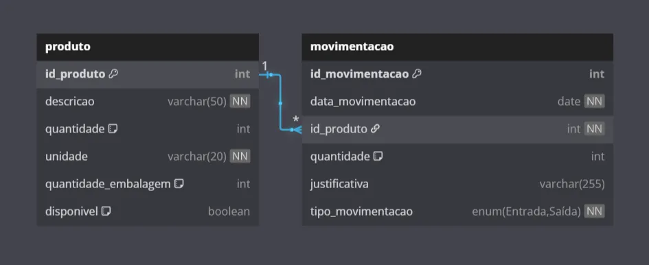

➜ Disponível em:  
🔗 [Ver Diagrama no DBDiagram](https://dbdiagram.io/d/Sarsdev_teste_webapp_reactjs-67df124675d75cc84416d48a)

---

## 📁 Estrutura do Projeto

### 🧠 `api/` – Backend

Contém o servidor da aplicação, criado com **Node.js** e **Express**. Essa API RESTful é responsável por todas as regras de negócio e persistência de dados, utilizando um banco de dados **SQLite**.

📌 Funcionalidades:

- CRUD de produtos e movimentações
- Controle de entrada e saída de produtos
- Validações e boas práticas REST

🔗 [Documentação detalhada da API](./api/README.md)

---

### 🎨 `spa/` – Frontend

O frontend foi desenvolvido em **React.js** com Vite, consumindo a API via **Axios**. Apresenta uma interface amigável para usuários consultarem e gerenciarem o estoque.

🎯 Destaques:

- Páginas modulares com componentes reutilizáveis
- Acessibilidade com suporte a daltonismo
- Integração com API
- Layout adaptado responsivamente para diferentes dispositivos

🔗 [Documentação detalhada do Frontend](./spa/README.md)

---

## 📸 Exemplo Prático – Funcionalidades em Ação

Nesta seção, apresentarei o funcionamento prático da aplicação, com capturas de tela e exemplos reais de uso da interface e API. Cada etapa representa uma parte funcional do fluxo de controle de estoque.

Tela Principal
---
> 

---

### 🧾 Exibição dos Produtos e Movimentações

A tela inicial exibe a **lista de produtos cadastrados e Movimentações**, com suas respectivas **quantidades**, **status (Disponível/Indisponível)** e outras informações, além do botão para visualizar o histórico de movimentações (entradas e saídas) de um produto específico.

📌 **Funcionalidades envolvidas**:

- Integração direta com a API
- Consulta de produtos e movimentações via API
- Listagem paginada e/ou com scroll
- Visualização de movimentações associadas ao produto

Produtos
---
> 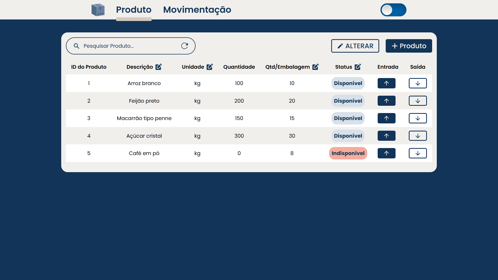
---
Movimentações
---
> 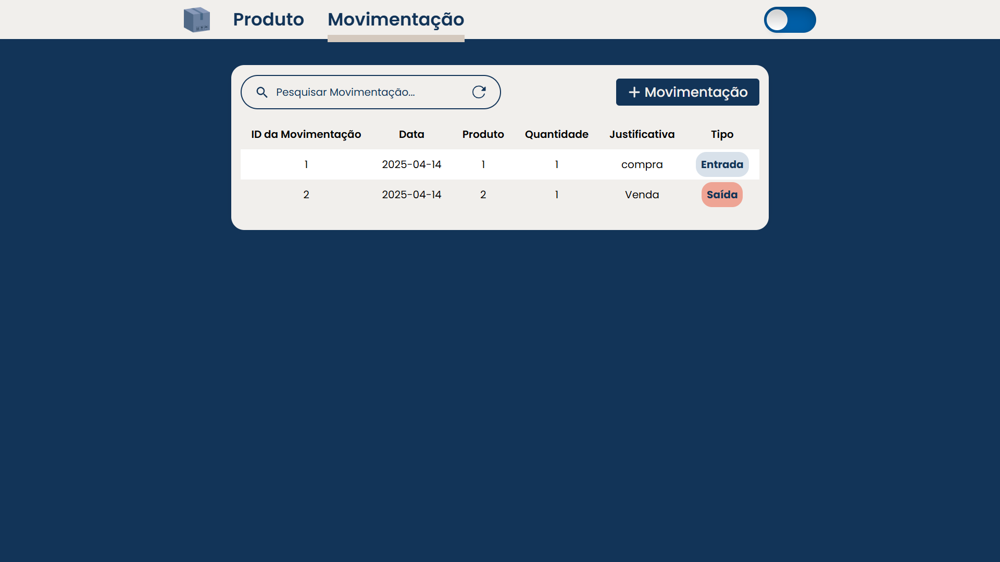

---

### ➕ Criando um Novo Produto

Nesta etapa, o usuário realiza o cadastro d **um produto no estoque**, preenchendo informações como descrição, quantidade, unidade, quantidade por embalagem e diponibilidade (status).

📌 **Funcionalidades envolvidas**:

- Formulário de criação de produto
- Requisição `POST` para o endpoint de produtos
- Validação de campos
- Feedback visual (ex: Toast de sucesso)
- Atualização dinâmica da lista de produtos

Produto Disponível
---
> 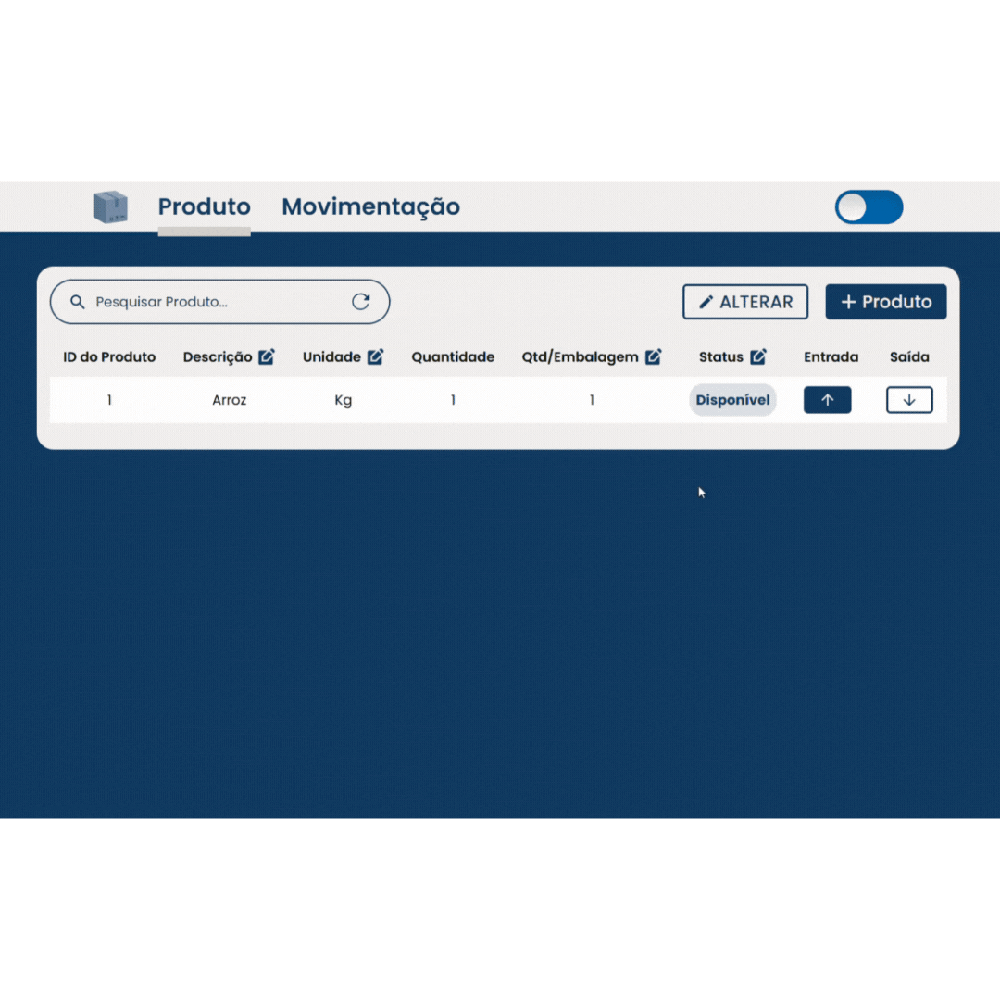
---
Produto Indisponível
---
> 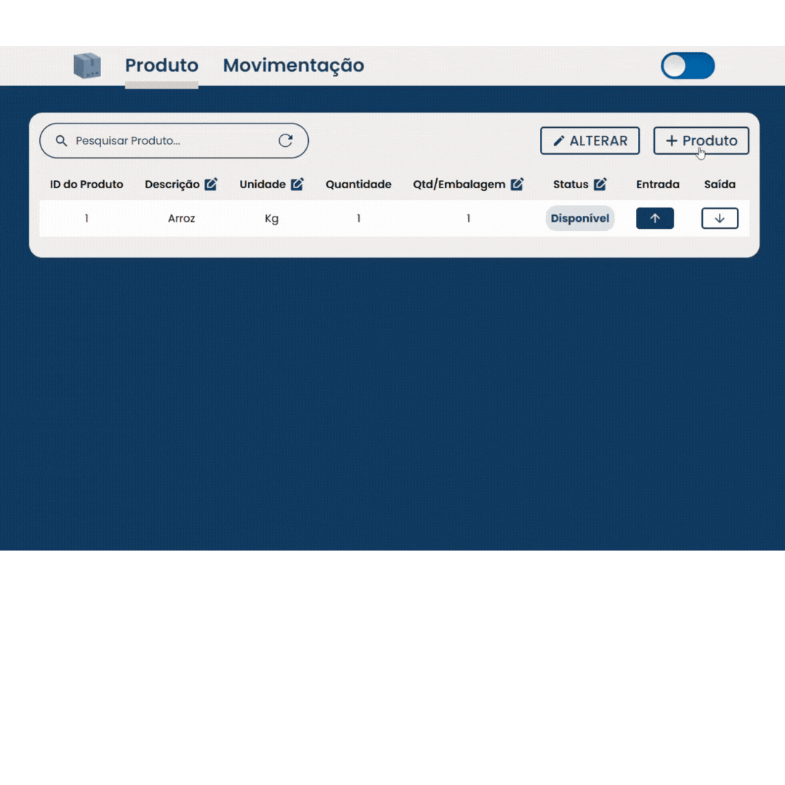

---

### 🔄 Criando uma Movimentação

Se haver um produto, o usuário pode registrar uma **movimentação de entrada ou saída**, informando a quantidade, a justificativa e a data.

📌 **Funcionalidades envolvidas**:

- Seleção de tipo de movimentação (entrada/saída)
- Atualização do estoque em tempo real
- Registro histórico da movimentação de um produto

Movimentação de Saída
---
> 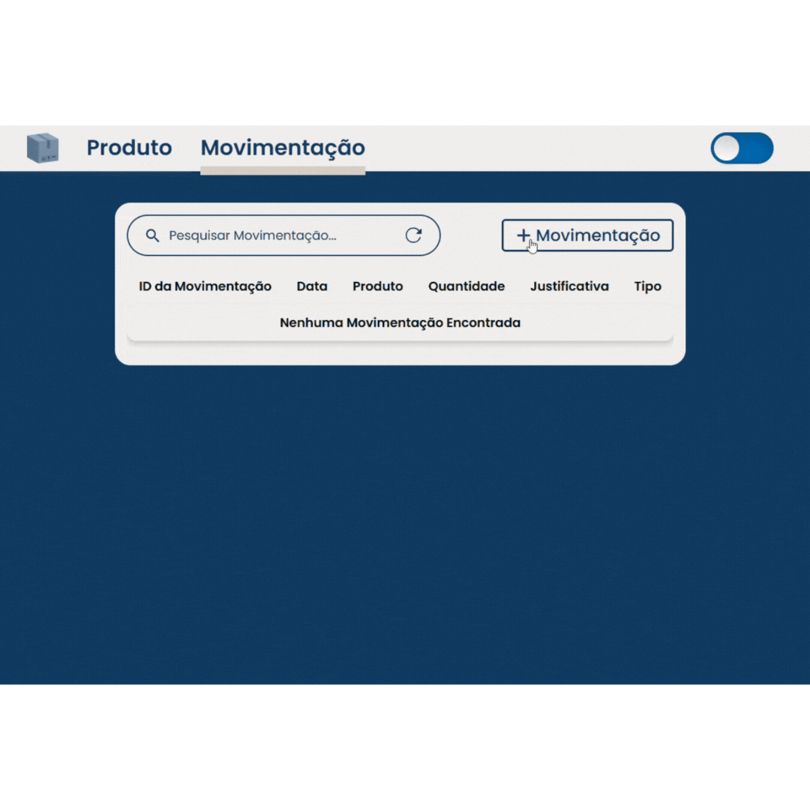
---
Movimentação de Entrada
---
> 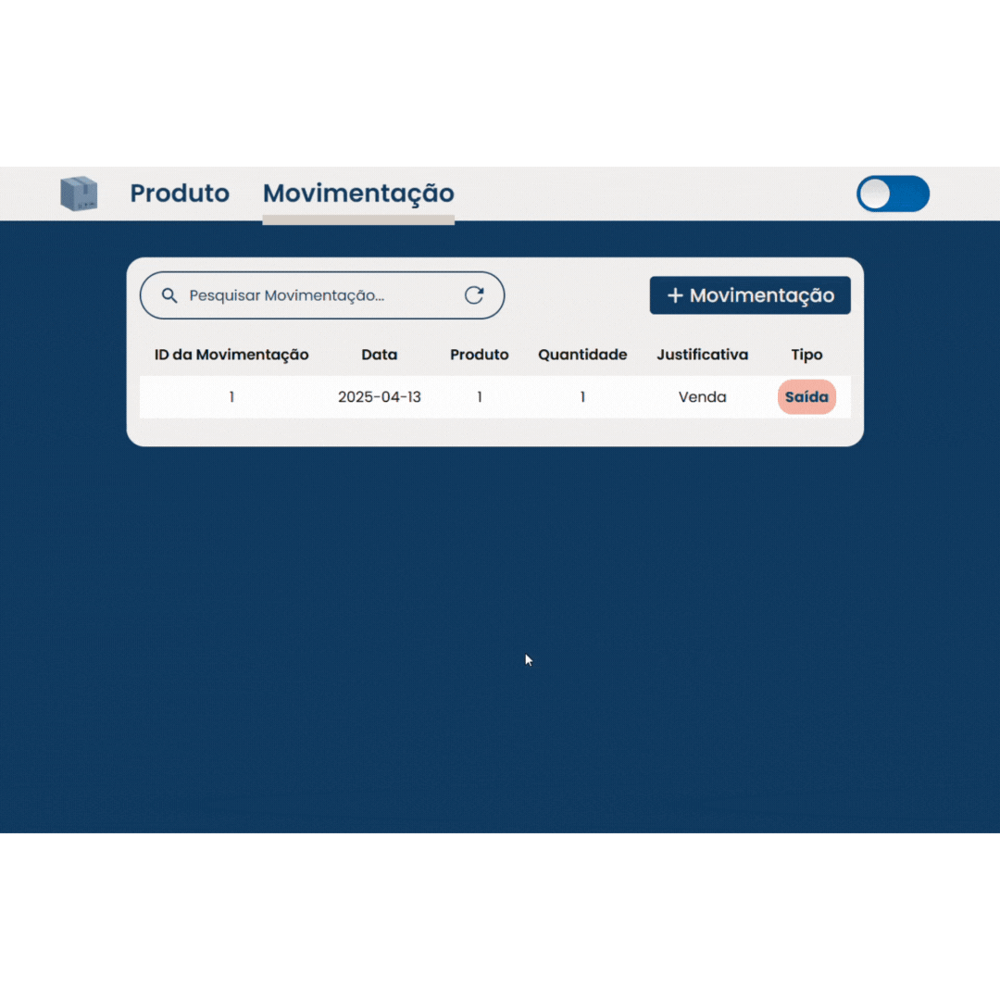

---

### 🔧 Editando um Produto (Informações Completas)

Exemplo de edição completa: alterando **descrição**, **unidade**, **quantidade por embalagem**, **Disponibilidade** (status). Ideal para atualizações importantes no cadastro do produto.

❗ Obs: A quantidade total de um produto não pode ser alterada diretamente, pois está vinculada às movimentações (entradas e saídas).

📌 **Funcionalidades envolvidas**:

- Requisição `PUT` com dados modificados
- Atualização visual do item na lista

Alterar informações do produto
---
> 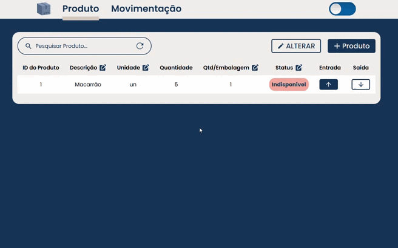

---

### ✏️ Editando um Produto (Edição Parcial)

Edição rápida de um ou dois campos, como apenas a **descrição**, **unidade**, **quantidade por embalagem** e a **Disponibilidade** (Disponível/Indisponível).

❗ Obs: A quantidade total de um produto não pode ser alterada diretamente, pois está vinculada às movimentações (entradas e saídas).

📌 **Funcionalidades envolvidas**:

- Requisição parcial método `PATCH`
- Manutenção de dados não modificados

Alterar parcialmente informações do produto
---
> 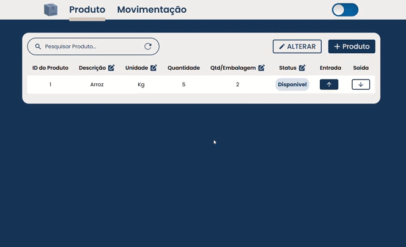

---

### 🔍 Utilizando o Mecanismo de Pesquisa

A barra de pesquisa permite filtrar produtos e movimentação por descrição/justificativa, ids, tipo de movimentação ou status. O resultado aparece dinamicamente.

📌 **Funcionalidades envolvidas**:

- Atualização em tempo real conforme o usuário digita

Pesquisa de produtos
---
> 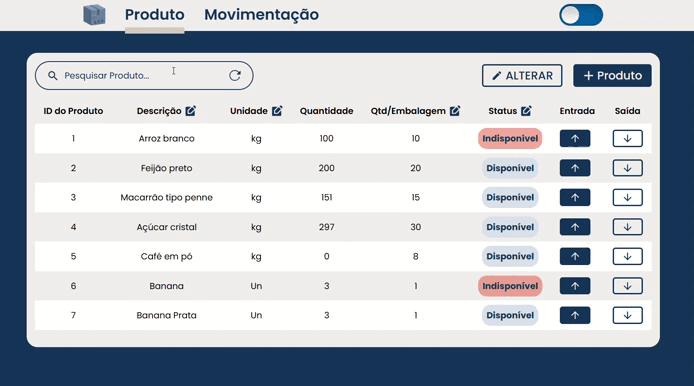

Pesquisa de Movimentações
---
> 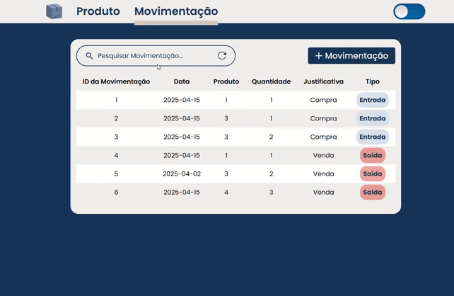

---

<!-- > ⚙️ Em breve: Exemplo de **relatórios semanais**, **ajuste de planilhas** e **exportação de dados**. -->
